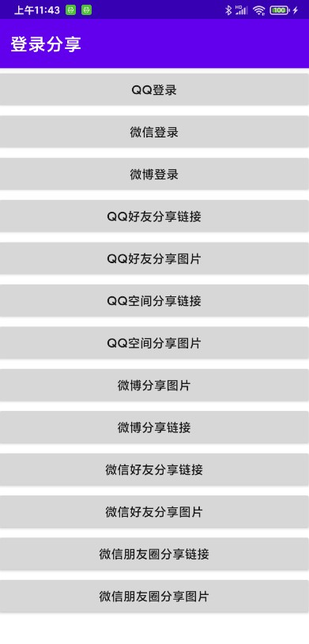

# AndroidShare
Android官网（微信，QQ，微博）集成，包含登录和分享。<br/>
#### 欢迎关注我的微信公众号(微信扫一扫)<br/>
<br/>
## Demo效果预览<br/>
#### apk下载<br/>
<br/>
#### 效果<br/>
<br/>
## 问题须知【一定要阅读】
<p>
1、Demo里的微信，QQ，微博的Key或者Id，都是用的测试的，大家在用的时候，务必换成自己申请的。
</p>
<p>
2、Demo代码下载后，是不能实现登录分享的，因为需要签名，毕竟牵扯到保密，签名文件并没有提交，大家如果测试，可以更换成自己的签名文件即可，查看效果，扫描二维码下载即可。
</p>
<p style="color:#ff0000;">
3、大家下好apk，如果图片报错，需要大家自己把Demo中mipmap下的ic_launcher.png复制到手机sd卡根路径下即可，仅做测试用，实际大家还是按照需求而定。
</p>

## 具体调用

### 第一步，根项目下build.gradle
```
repositories {
        ……
        maven { url "https://gitee.com/AbnerAndroid/android-maven/raw/master" }
    }
```
### 第二步，在需要的module下build.gradle
```
    implementation 'com.abner:share:1.0.0'
```

### 第三步，初始化，传自己申请的微信，QQ，微博信息
```
    ShareUtils.get().initShare(
            this,
            BuildConfig.WX_ID,
            BuildConfig.QQ_ID,
            BuildConfig.WB_KEY
        )

```
### 第四步，清单文件注册，WXEntryActivity需要在wxapi包下创建，一定要按照标准，可直接复制Demo中的，tencent1112002456是填自己申请的。

```
 <activity
            android:name=".wxapi.WXEntryActivity"
            android:configChanges="keyboardHidden|orientation|screenSize"
            android:exported="true"
            android:theme="@android:style/Theme.Translucent.NoTitleBar" />
        <activity
            android:name="com.tencent.tauth.AuthActivity"
            android:launchMode="singleTask"
            android:noHistory="true">
            <intent-filter>
                <action android:name="android.intent.action.VIEW" />

                <category android:name="android.intent.category.DEFAULT" />
                <category android:name="android.intent.category.BROWSABLE" />

                <data android:scheme="tencent1112002456" />
            </intent-filter>
        </activity>

```

### 第五步，具体使用，可直接参考Demo中的MainActivity，或参照下面

#### QQ登录
```
                ShareUtils.get()
                    .login(this, ShareUtils.QQ)
                    .setOnQqCallBackListener({
                        //登录成功
                        Toast.makeText(this, it.toString(), Toast.LENGTH_LONG).show()
                    }, {
                        //登录失败
                    })

```
#### 微信登录，回调在WXEntryActivity类中
```
ShareUtils.get().login(this, ShareUtils.WEIXIN)

```
#### 微博登录
```
 ShareUtils.get().login(this, ShareUtils.WEIBO)
                    .setOnWbCallBackListener({
                        //成功
                        Toast.makeText(this, "微博登录成功", Toast.LENGTH_LONG).show()
                    }, {
                        //失败
                    })

```
#### QQ好友分享链接
```
	//注意，图片地址需要自己生成，这里我使用的是简单的测试
                val absoluteFile = Environment.getExternalStorageDirectory().absoluteFile
                val imagePath = "$absoluteFile/ic_launcher.png"
                ShareUtils.get().qwShareUrl(
                    this,
                    ShareUtils.QQ,
                    "我是测试分享标题",
                    "我是测试分享链接",
                    "https://www.vipandroid.cn/ming/page/open.html",
                    imagePath,
                ).setOnQqCallBackListener({
                    Log.e(TAG, "分享成功")
                }, {
                    Log.e(TAG, "分享失败")
                })

```
#### QQ好友分享图片
```
	//注意，图片地址需要自己生成，这里我使用的是简单的测试
                val absoluteFile = Environment.getExternalStorageDirectory().absoluteFile
                val imagePath = "$absoluteFile/ic_launcher.png"
                ShareUtils.get().qwShareImage(
                    this,
                    ShareUtils.QQ,
                    imagePath,
                ).setOnQqCallBackListener({
                    Log.e(TAG, "分享成功")
                }, {
                    Log.e(TAG, "分享失败")
                })

```
#### QQ空间分享链接
```
	//注意，图片地址需要自己生成，这里我使用的是简单的测试
	val absoluteFile = Environment.getExternalStorageDirectory().absoluteFile
                val imagePath = "$absoluteFile/ic_launcher.png"
                ShareUtils.get().qwShareUrl(
                    this,
                    ShareUtils.QQ,
                    "我是测试分享标题",
                    "我是测试分享链接",
                    "https://www.vipandroid.cn/ming/page/open.html",
                    imagePath,
                    ShareUtils.SCENE
                )

```
#### QQ空间分享图片
```
	//注意，图片地址需要自己生成，这里我使用的是简单的测试
	val absoluteFile = Environment.getExternalStorageDirectory().absoluteFile
                val imagePath = "$absoluteFile/ic_launcher.png"
                ShareUtils.get().qwShareImage(
                    this,
                    ShareUtils.QQ,
                    imagePath,
                    ShareUtils.SCENE
                ).setOnQqCallBackListener({
                    Log.e(TAG, "分享成功")
                }, {
                    Log.e(TAG, "分享失败")
                })

```
#### 微博分享图片
```
	//注意，图片地址需要自己生成，这里我使用的是简单的测试
 	val absoluteFile = Environment.getExternalStorageDirectory().absoluteFile
                val imagePath = "$absoluteFile/ic_launcher.png"
                ShareUtils.get().qwShareImage(this, ShareUtils.WEIBO, imagePath)

```
#### 微博分享链接
```
	//注意，图片地址需要自己生成，这里我使用的是简单的测试
 	val absoluteFile = Environment.getExternalStorageDirectory().absoluteFile
                val imagePath = "$absoluteFile/ic_launcher.png"
                ShareUtils.get().qwShareUrl(
                    this, ShareUtils.WEIBO,
                    "我是测试标题", "我是测试描述", "https://www.vipandroid.cn", imagePath
                )

```
#### 微信好友分享链接
```
	//注意，图片地址需要自己生成，这里我使用的是简单的测试
 	val absoluteFile = Environment.getExternalStorageDirectory().absoluteFile
                val imagePath = "$absoluteFile/ic_launcher.png"
                ShareUtils.get().qwShareUrl(
                    this,
                    ShareUtils.WEIXIN,
                    "我是测试标题",
                    "我是测试描述",
                    "https://www.vipandroid.cn",
                    imagePath
                )

```
#### 微信好友分享图片
```
	//注意，图片地址需要自己生成，这里我使用的是简单的测试
 	val absoluteFile = Environment.getExternalStorageDirectory().absoluteFile
                val imagePath = "$absoluteFile/ic_launcher.png"
                ShareUtils.get().qwShareImage(this, ShareUtils.WEIXIN, imagePath)

```
#### 微信朋友圈分享链接
```
	//注意，图片地址需要自己生成，这里我使用的是简单的测试
 	val absoluteFile = Environment.getExternalStorageDirectory().absoluteFile
                val imagePath = "$absoluteFile/ic_launcher.png"
                ShareUtils.get().qwShareUrl(
                    this,
                    ShareUtils.WEIXIN,
                    "我是测试标题",
                    "我是测试描述",
                    "https://www.vipandroid.cn",
                    imagePath, ShareUtils.SCENE
                )

```

#### 微信朋友圈分享图片
```
	//注意，图片地址需要自己生成，这里我使用的是简单的测试
 	val absoluteFile = Environment.getExternalStorageDirectory().absoluteFile
                val imagePath = "$absoluteFile/ic_launcher.png"
                ShareUtils.get().qwShareImage(this, ShareUtils.WEIXIN, imagePath, ShareUtils.SCENE)

```

### 回调
```
override fun onActivityResult(requestCode: Int, resultCode: Int, data: Intent?) {
        super.onActivityResult(requestCode, resultCode, data)
        if (data != null) {
            //QQ回调
            ShareUtils.get().onQqActivityResult(requestCode, resultCode, data)
            //微博回调
            ShareUtils.get().onWbShareActivityResult(data, object : WbShareCallback {
                override fun onComplete() {

                }

                override fun onError(p0: UiError?) {
                }

                override fun onCancel() {

                }

            })
        }

    }

```

### WXEntryActivity
```
class WXEntryActivity : Activity(), IWXAPIEventHandler {

    private var mIWXAPI: IWXAPI? = null

    override fun onCreate(savedInstanceState: Bundle?) {
        super.onCreate(savedInstanceState)
        mIWXAPI = WXAPIFactory.createWXAPI(this, BuildConfig.WX_ID)
        mIWXAPI!!.handleIntent(intent, this)
    }

    override fun onNewIntent(intent: Intent?) {
        super.onNewIntent(intent)
        setIntent(intent)
        mIWXAPI!!.handleIntent(intent, this)
    }

    override fun onReq(resp: BaseReq?) {

    }

    override fun onResp(resp: BaseResp?) {
        when (resp!!.errCode) {
            BaseResp.ErrCode.ERR_OK -> {
                if (resp.type == ConstantsAPI.COMMAND_SENDMESSAGE_TO_WX) {
                    //分享,做一些其他操作

                    finish()
                } else if (resp.type == ConstantsAPI.COMMAND_SENDAUTH) { //登陆
                    val code = (resp as SendAuth.Resp).code
                    Toast.makeText(this, "微信登录成功", Toast.LENGTH_LONG).show()

                    //根据code，和服务端进行绑定，获取信息后执行后续操作

                    finish()
                }
            }
            else -> {
                finish()
            }
        }
    }

}

```


